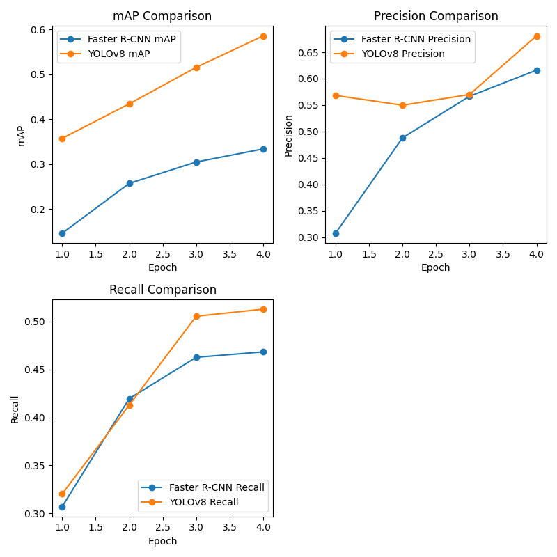
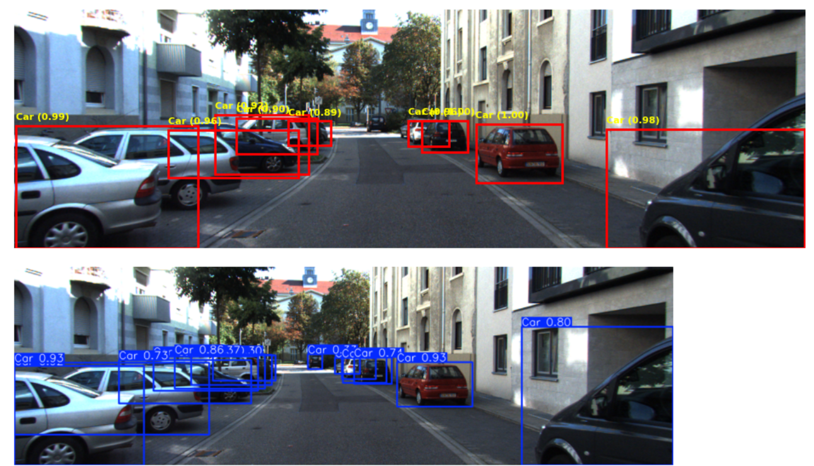
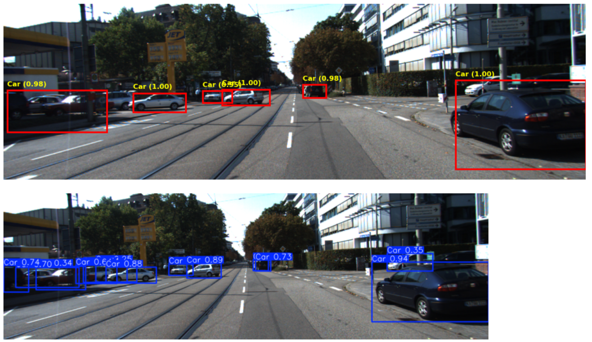

# Object Detection of Autonomous Vehicles

This project focuses on object detection for autonomous driving using the KITTI dataset. Two different models are implemented and compared: Faster R-CNN using PyTorch and YOLOv8 using the Ultralytics framework.

## Table of Contents

- [Project Overview](#project-overview)
  - [KITTI Dataset](#kitti-dataset)
  - [Models Used](#models-used)
    - [Faster R-CNN](#faster-r-cnn)
    - [YOLOv8](#yolov8)
- [Workflow](#project-workflow)
- [Directory Structure](#directory-structure)
- [How to Run](#how-to-run)
  - [Faster R-CNN](#faster-r-cnn-1)
  - [YOLOv8](#yolov8-1)
  - [Model Comparison](#model-comparison)
- [Evaluation Metrics](#evaluation-metrics)
- [Training and validation Times](#training-and-validation-times)
- [Test Results](#test-results)
  - [Test Images](#test-images)
  - [Test Videos](#test-videos)
- [Conclusion](#conclusion)
- [References](#references)

## Project Overview

### KITTI Dataset

The KITTI dataset is a widely used benchmark in the field of autonomous driving. It contains 7,481 training images and 7,518 test images, along with their corresponding annotations. The images are taken from a vehicle driving in and around the city of Karlsruhe, Germany. 

For this project, we focus on identifying and localizing objects in the image. There are eight categories and corresponding bounding boxes: Car, Pedestrian, Cyclist, Van, Truck, Person_sitting, Tram, and Misc. The KITTI dataset is split into training (and validation), and testing sets, with annotations available only for the training set.


Fully Equiped Vehicle with different sensors


Sensor Setup with respect to vehicle

Image Source: [KITTI Vehicle Setup](https://www.cvlibs.net/datasets/kitti/setup.php)

### Models Used

#### 1. Faster R-CNN

Faster R-CNN (Region Convolutional Neural Network) is a popular deep learning model for object detection, known for its accuracy and robustness. It is a two-stage model which are:
- **Region Proposal Network (RPN)**: This network proposes regions in the image that are likely to contain objects.
- **Object Detection**: The proposed regions are then classified and refined to predict the exact bounding boxes and classes of the object.

Although Faster R-CNN is known for its accuracy, it can be slow in training and simulation due to the two-stage approach, where region proposals are generated and then optimized. This makes it less suitable for real-time applications but are more effective where accuracy is critical.

In this project, the Faster R-CNN model is implemented using PyTorch, where the backbone of ResNet-50 is combined with the Feature Pyramid Network (FPN) for efficient processing at different scales. The model is pre-trained on the COCO dataset and fine-tuned on the KITTI dataset.

#### 2. YOLOv8

YOLOv8 (You Only Look Once, Version 8) is the latest in the YOLO family of models, known for its real-time performance in object recognition. YOLOv8 improves upon its predecessor by introducing more efficient architectures, better loss functions, and advanced data augmentation techniques. Unlike Faster R-CNN, YOLO is a single-stage object detector, which means that it directly predicts bounding box and class probabilities from the entire image in one go.

For this project, YOLOv8 is implemented using the Ultralytics framework, which provides easy-to-use tools for training, validation, and testing. The model is fine-tuned on the KITTI dataset using a base model (`yolov8n.pt`).

## Workflow

1. **Preprocessing**:
   - Resized images to a target size of `(375, 1242)` based on the most common image dimensions.
   - Converted images from `.png` to `.jpg` with 85% quality to reduce the dataset size from over 5 GB, preventing out-of-memory errors.
   - Split the dataset into `train` and `val` sets with an 80-20 ratio.

2. **Faster R-CNN Model**:
   - Converted KITTI annotations to COCO format, excluding the "don't care" class.
   - Defined a Faster R-CNN model using a `ResNet50` backbone with FPN from PyTorch.
   - Trained the model with a learning rate of `0.001`, a batch size of `4`, and early stopping after 4 epochs based on mAP score.
   - Evaluated the model on validation data and tested on new images and videos.

3. **YOLOv8 Model**:
   - Converted COCO annotations to YOLO format.
   - Configured and trained a YOLOv8 model for 4 epochs using the `yolov8n.pt` base model.
   - Evaluated the model on validation data and tested on new images and videos.

## Directory Structure

```
├── dataset_object_image_2  # Contains the KITTI dataset training images
|   └── ...
├── dataset_object_label_2  # Contains the annotations for the KITTI training images
|   └── ...
├── datasets                # Contains the split datasets (train, val, test) with corresponding images and labels
│ ├── train
│ │ ├── images
│ │ └── labels
│ ├── val
│ │ ├── images
│ │ └── labels
│ └── test
├── faster_rcnn_checkpoints # Contains the saved model weights for the best performing Faster R-CNN model
├── images                  # Contains images necessary for the markdown file
├── runs                    # Contains the outputs from the YOLOv8 model training, including the best model weights
│ └── detect
|   └── predict
|   └── predict2
|   └── train
|   └── train2
|   └── train3
|   └── train4
├── video                   # Contains predicted video files from both the models
├── LICENCE.txt             # Licence informations
├── README.md               # Project Informations
├── concat.py               # File to concat splitted faster rcnn model weights
├── data.yml                # Configuration file for YOLOv8 training
├── faster_rcnn.ipynb       # Jupyter notebook for training and evaluating the Faster R-CNN model
├── model_comparison.ipynb  # Jupyter notebook which compares both the trained models on KITTI dataset
├── split.py                # File to split faster rcnn trained weights to parts (used for github upload)
├── yolov8.ipynb            # Jupyter notebook for training and evaluating the YOLOv8 model
└── yolov8n.pt              # Pre-trained YOLOv8 base model
```

## How to Run

### Concatenating Faster R-CNN Model Weights

If you have received the model weights in multiple parts, follow these steps to concatenate them back together:

1. Clone the repository and navigate to the directory.
2. Open command prompt in the directory.
3. Run the `concat.py` script to merge the split files back into the original model weights file:
 
```
python concat.py
```

### Faster R-CNN

1. Clone the repository and navigate to the directory.
2. Open `faster_rcnn.ipynb` in Jupyter Notebook or JupyterLab.
3. Execute the cells sequentially to preprocess the data, train the model, and evaluate it on test images and video.

### YOLOv8

1. Clone the repository and navigate to the directory.
2. Open `yolov8.ipynb` in Jupyter Notebook or JupyterLab.
3. Execute the cells sequentially to convert annotations, train the YOLOv8 model, and evaluate it on test images and video.

### Model Comparison

1. Clone the repository and navigate to the directory.
2. Open `model_comparison.ipynb` in Jupyter Notebook or JupyterLab.
3. Execute the cells sequentially to compare the evaluation metrices, predict on common images, and compare the inference time between two models.

## Evaluation Metrics

- **Precision**: Measures the accuracy of the positive predictions. Precision of YOLOv8 model (0.6809) is slightly higher than that of Faster R-CNN model (0.6160).
- **Recall**: Measures the ability to find all positive instances. Recall of YOLOv8 model (0.5130) is higher than that of Faster R-CNN model (0.4196).
- **mAP (Mean Average Precision)**: Provides a comprehensive measure of performance. The mAP value of YOLOv8 model (0.5858) is higher than that of Faster R-CNN model (0.3341).



| **Metric**                          | **Faster R-CNN** | **YOLOv8** |
|-------------------------------------|------------------|------------|
| Mean Average Precision (mAP)        | 0.33             | 0.58       |
| Precision                           | 0.61             | 0.68       |
| Recall                              | 0.46             | 0.51       |
| Training Time                       | 37.10 hrs        | 5.90 hrs   |
| Validation Time                     | 233.89 mins      | 3.16 mins  |
| Image Inference Time (single)       | 4.96 s           | 0.29 s     |
| Video Inference Time (30 sec)       | 3715.93 sec      | 278.50 sec |

### Training and Validation Times

- For both models, training and validation times are calculated to compare efficiency. Faster R-CNN almost took 37.10 hours for completing 4 epochs of training while YOLOv8 model took only 5.90 hours. The former took 3.89 hours (233.89 mins) while YOLOv8 took only 190.83 seconds (3.16 mins) for 4 epochs. Thus Faster R-CNN took way long time than YOLOv8.
- Inference time on test images and videos is also recorded. The prediction time (including pre-processing, predicting and post-processing) of images for Faster R-CNN is high which is 4.9641 seconds, while YOLOv8 model is 0.2974 seconds only, which can be suitable for real-time application. 
- However, while YOLOv8 is faster than Faster R-CNN for processing an image and predicting output, its video inference time of 278.50 seconds (4.64 minutes) for a 30 seconds (906 frames) video still fall short of real-time processing requirements which are crucial for applications like autonomous driving.

## Test Results

### Test Images

Test images of Faster R-CNN and YOLOv8 showing predicted object bounding box with confidence level and corresponding labels.




### Test Videos

Both the models are tested on some video files and the output files are available in [Video](video) directory. Faster R-CNN took so long to process, 3715.93 seconds (61.93 mins) compared to YOLOv8 model of 278.50 seconds (4.64 mins) a video file of 30 seconds. It is clear that eventhough YOLOv8 algorithm is faster in predicting output classes compared to Faster R-CNN model, it is not suitable for real-time application due to its slow inference speed. Hence we need to look into different alternative models for object detection in autonous driving.

## Conclusion

This project compares the performance of Faster R-CNN and YOLOv8 for object detection on the KITTI dataset. Under the condition of limited epoch of 4, YOLOv8 performs better compared to Faster R-CNN. However, YOLOv8 model is not suitable for real-time application since its video processing time is huge.

## References

- [KITTI Dataset](https://www.cvlibs.net/datasets/kitti/eval_object.php?obj_benchmark=2d)
- [PyTorch fasterrcnn_resnet50_fpn](https://pytorch.org/vision/master/models/generated/torchvision.models.detection.fasterrcnn_resnet50_fpn.html#torchvision.models.detection.fasterrcnn_resnet50_fpn)
- Jocher, G., Chaurasia, A., & Qiu, J. (2023). Ultralytics YOLO (Version 8.0.0) [Computer software]. https://github.com/ultralytics/ultralytics
- Ren, S., He, K., Girshick, R., Sun, J.(2016)'Faster R-CNN: Towards Real-Time Object Detection with Region Proposal Networks'Computer Vision and Pattern Recognition. Available at: https://doi.org/10.48550/arXiv.1506.01497 (Accessed on 14 June 2024).
- Geiger, A., Lenz, P., Urtasun, R.(2012) "Are we ready for autonomous driving? The KITTI vision benchmark suite," 2012 IEEE Conference on Computer Vision and Pattern Recognition, Providence, pp. 3354-3361. Available at: https://doi.org/10.1109/CVPR.2012.6248074 (Accessed on 21 May 2024).

## License

This project is licensed under the MIT License - see the [LICENSE](LICENSE.txt) file for details.
